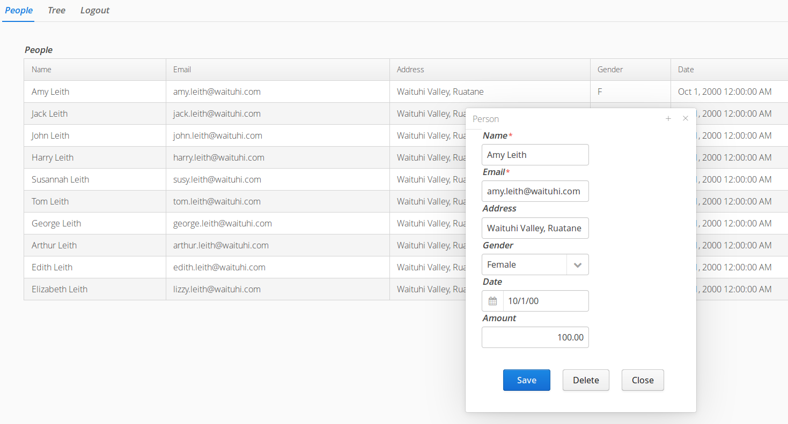

madura-address-book
==

A demo program that illustrates the extended JPAContainer and the table editor from [madura-vaadin-tableeditor](../madura-vaadin-tableeditor/README.md).

This combination provides an almost out-of-the box database table editor complete with a pop-up dialog box to insert and edit table rows. The dialog automatically uses the Madura validation engine for validation. In this example we do not use Madura Rules which would enable cross field validation, however this could be added without changing the code. What we do see here in terms of validation is:

 * the email field requires an '@' symbol in it or we show an error message.
 * both name and email are required.
 * the save button is disabled until required fields are completed and error free.

These are driven entirely by the underlying Madura validation engine, with no specific code in the UI except to create the save button as a submit button.

The JPA container is an extension of Vaadin's JPA Container and is configured here through the [ConfigJPA](src/main/java/nz/co/senanque/addressbook/jpa/ConfigJPA.java) class to use an in-memory H2 database.

More detailed documentation for this is found in the [madura-vaadin](../madura-vaadin/README.md) project.

Build and Run
--
To compile the entire project, run "mvn install" then deploy the war file to your favourite servlet engine. Or you can use Eclipse and WTP, which is our development environment, using Tomcat 8 and Java8.

Script
--
login with admin/admin

Right click on any entry in the table to see options to add, delete and edit the entries.
The popup form that edits uses Madura to validate as described above.

You can change the language by selecting French in the login form and the captions etc will change accordingly.

