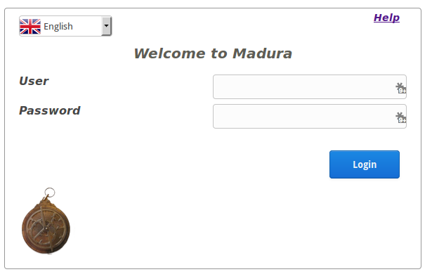

#madura-login#

Web fragment that provides authentication and authorization services for application.
Probably only useful for demos.

Can be customised by:

 * adding a customised login.html to the resources directory
 * adding a customised login.css to resources/css
 * adding a logo.gif file to resources/images
 * adding a users.csv to WEB-INF. You actually need this file if you want anyone to log in.
 * deploying a different AuthenticationDelegate implementation as a bean.
 
Things a production version ought to have:

 * remember me
 * security timeout
 * forgot password, change password
 * a more dynamic/robust way of storing the password (ie a production implementation of AuthenticationDelegate.java)
  
To do:

 * doesn't work at all on Chromium browser, ie doesn't redirect to application.
 
More detailed documentation for this is found in the [madura-vaadin](../madura-vaadin/README.md) project.

