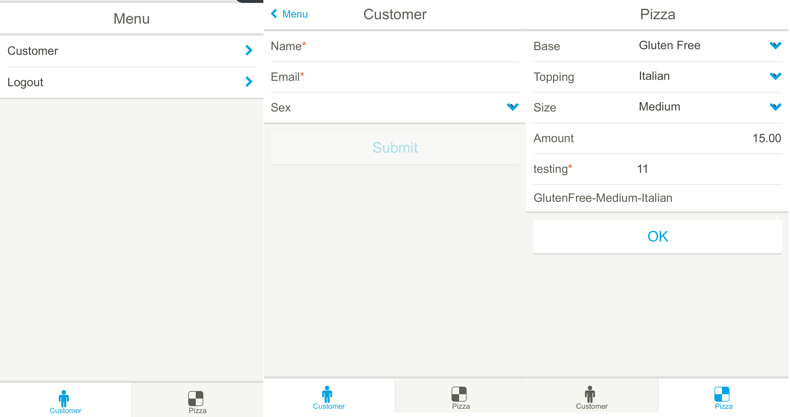

madura-mobile-demo
==

(A more detailed document can be found at [Madura Vaadin (PDF)](http://www.madurasoftware.com/madura-vaadin.pdf)) 

The mobile demo presents two UIs both running off the same objects and rules, so it uses Madura Objects, Madura Rules, Vaadin and Vaadin's mobile interface: Touchkit. It is fairly similar to the [madura-rules-demo](../madura-rules-demo/README.md) project though the UI is a bit smaller to keep the demo simple.

The important features to notice here are:

 * The forms behave in the same way as the other demos but in a mobile environment
 * Programming for the mobile UI is just as trivial, though slightly different in places because there are mobile controls.
 * There is no change to the underlying rules to implement mobile. That means you can share the same business rules across multiple UIs without those UIs having to be aware of the rules.
 * All of the other Madura features such as I18n, error messaging, transparent invoking of rules etc are all fully functional in the mobile environment.

More detailed documentation for this is found in the [madura-vaadin](../madura-vaadin/README.md) project.

Build and Run
--
To compile the entire project, run "mvn install".
To run the application, run "mvn jetty:run" and open http://localhost:8080/

Or you can use Eclipse and WTP, which is our development environment, using Tomcat 7 and Java8

The maven build includes a profile that will use Phonegap to turn the application into an apk file you can install on an Android device. Phonegap supports
other mobile devices for which you need to apply for an id from the relevant app store.

Script
--
login with admin/admin

In both desktop and mobile UIs there are two tabs. One is the same as the person tab seen in the other demos. The submit button is disabled until the
required fields (name and email) are entered without error. The other is the pizza configuration which adjusts its choice lists according to what else
was chosen, sets the amount field with a value and also makes the testing field active and/or required depending on what was chosen.

You can try this on the desktop in the obvious way, and you can browse to the same URL from a mobile device to see the mobile UI.

