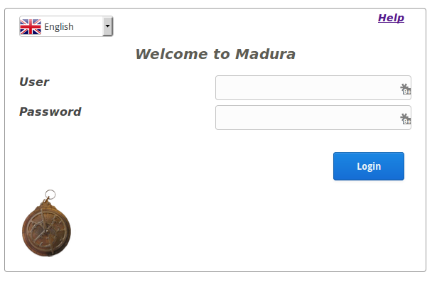

madura-springsecurity-login
==

(A more detailed document can be found at [Madura Vaadin (PDF)](http://www.madurasoftware.com/madura-vaadin.pdf)) 

Web fragment that provides authentication and authorization services for application.
Probably only useful for demos.

This is a rewrite of [madura-login](../madura-login/README.md) and supersedes that project. The differences:

 * Less customisation of the login page. You can set properties to change the wording etc but you can't supply a different login page.
 * Works on Chrome (the old one did not work on Chrome at all)
 * Uses Spring Security
  
More detailed documentation for this is found in the [madura-vaadin](../madura-vaadin/README.md) project.

