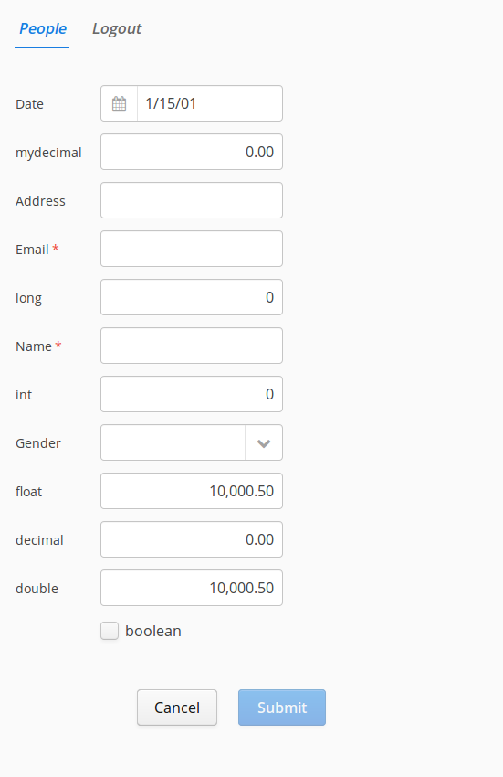

madura-vaadin-demo
==

(A more detailed document can be found at [Madura Vaadin (PDF)](http://www.madurasoftware.com/madura-vaadin.pdf)) 

This demo shows Vaadin and Madura Objects working together providing single field validation and a dynamic submit button which disables until the required fields are complete and without error.

It does not use Madura Rules so there is no cross-field validation, but it illustrates the configuration and code required to implement this much functionality. This is to show that Madura can be used without the rules engine and still be useful. 

Build and Run
--

To compile the entire project, run "mvn install" then deploy the war file to your favour servlet engine. Or you can use Eclipse and WTP, which is our development environment, using Tomcat 8 and Java8.

Script
--
Login with admin/admin

The Submit button is inactive until the form is completed, and without errors 'complete' means all the required fields have valid values. Name and Email are required but address is not, also Email needs an '@' in it to be valid Try different values in the different fields and note how the Submit button changes

On the login dialog you can specify English or French. Try French, even if you don't speak French. You will see all the labels and options now in French once you log in. The translation is done in a normal Java resource bundle. Madura manages using the resource bundle to adjust the captions on the fields and buttons, as well as the choices in the drop down.

Docker
--
mvn clean package
sudo docker build -t madura/vadin-demo:3.2.2 .
sudo docker run -p 8080:8080 -d madura/vadin-demo:3.2.2
browse to http://localhost:8080/madura-vaadin-demo-3.2.2

